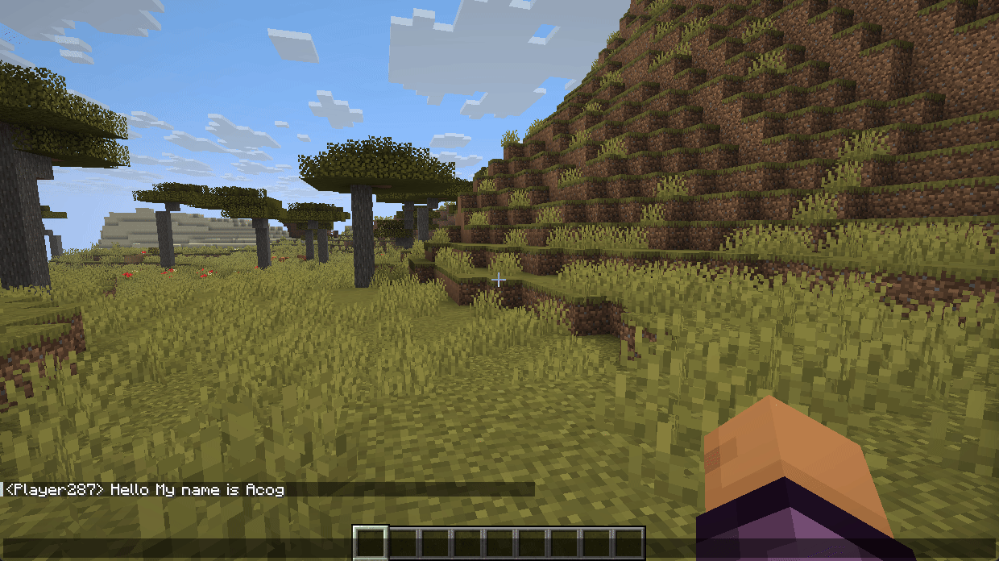
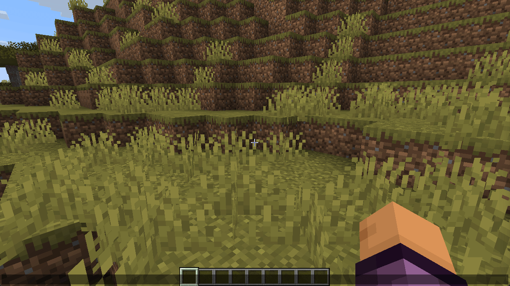
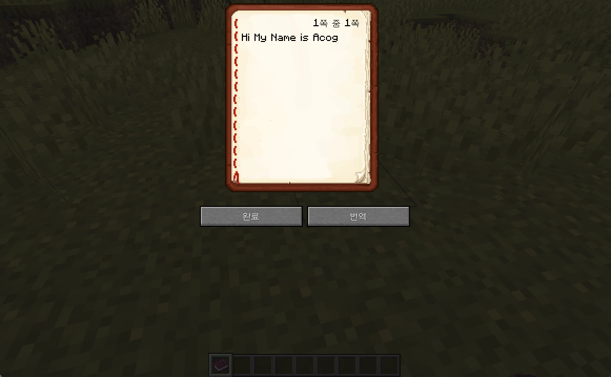

# Minecraft 번역 모드

마인크래프트에서 **AI를 활용한 실시간 번역**을 제공하는 Fabric 클라이언트 모드입니다. 채팅, 표지판, 책 등 게임 내 텍스트를 원하는 언어로 번역할 수 있습니다.  

> 인게임 이미지는 [아래](#인게임-이미지)에서 확인할 수 있습니다.
---

## 주요 기능

### 1. 채팅 수신 번역

채팅창에서 다른 플레이어의 메시지 위에 마우스를 올리면 번역된 텍스트가 툴팁으로 표시됩니다.
원본 채팅 로그는 그대로 유지되며, 번역 결과만 오버레이로 확인할 수 있습니다.

번역 대상 범위를 설정할 수 있습니다:

- **전체**: 채팅, 서버 공지, 시스템 메시지 등 모든 메시지 번역
- **채팅만**: 플레이어 채팅 메시지만 번역 (서버 공지, 입퇴장 알림 등 스킵)

> **참고**: "채팅만" 모드는 바닐라 서버 및 `<이름> 메시지`, `[랭크] <이름> 메시지` 형태로 채팅을 중계하는 Paper/Spigot 서버에서 동작합니다.
> `[이름] 메시지`, `이름: 메시지` 등 다른 포맷을 사용하는 서버에서는 **전체** 모드를 권장합니다.

---

### 2. 채팅 입력 번역 제안

채팅 입력창에 메시지를 입력하고 잠시 기다리면 (기본 3초), 설정한 언어로 번역된 문장이 자동 완성으로 제안됩니다.
`Tab` 키를 누르면 제안된 번역으로 즉시 대체됩니다.

---

### 3. 표지판 번역

표지판에 조준선을 올리면 화면 하단에 번역된 내용이 오버레이로 자동 표시됩니다.

한 번 번역된 표지판은 블록 위치를 키로 캐시에 저장되어 이후 재조준 시 API 호출 없이 즉시 표시됩니다. 최대 100개까지 LRU 방식으로 관리됩니다.

---

### 4. 책 번역

책을 열면 좌측 하단에 **번역** 버튼이 추가됩니다.
버튼을 클릭하면 현재 페이지를 번역하여 별도 화면에 결과를 표시합니다.

---

## 설치

이 모드는 **Fabric Loader**와 **Fabric API**가 필요합니다.

1. [Fabric Loader](https://fabricmc.net/use/) 설치 (마인크래프트 버전에 맞게)
2. [Fabric API](https://modrinth.com/mod/fabric-api) `.jar` 파일을 `mods` 폴더에 추가
3. [Releases](https://github.com/Acogkr/translate-mod/releases) 페이지에서 모드 파일을 다운로드하여 `mods` 폴더에 추가

---

## 설정

게임 내 `ESC` → `옵션` → `번역 모드 설정` 에서 접근합니다.
단축키 `O` (기본값)로 번역 모드를 켜고 끌 수 있습니다.

---

### AI 서비스 및 모델

**Gemini** — [Google AI Studio](https://aistudio.google.com/)에서 API 키 발급 (무료 티어 제공)

| 모델 | 속도 | 비용 |
|---|---|---|
| gemini-2.5-pro | 느림 | 높음 |
| gemini-2.5-flash | 보통 | 낮음 |
| gemini-2.5-flash-lite | 빠름 | 매우 낮음 |
| gemini-2.0-flash | 빠름 | 낮음 |
| gemini-2.0-flash-lite ✅ 추천 | 매우 빠름 | 매우 낮음 |

**OpenAI** — [OpenAI Platform](https://platform.openai.com/)에서 API 키 발급

| 모델 | 속도 | 비용 |
|---|---|---|
| gpt-4o | 보통 | 높음 |
| gpt-4o-mini | 빠름 | 낮음 |
| gpt-4-turbo | 느림 | 높음 |
| gpt-3.5-turbo | 빠름 | 매우 낮음 |

**Claude** — [Anthropic Console](https://console.anthropic.com/)에서 API 키 발급

| 모델 | 속도 | 비용 |
|---|---|---|
| claude-opus-4-6 | 느림 | 높음 |
| claude-sonnet-4-6 | 보통 | 높음 |
| claude-haiku-4-5 | 빠름 | 낮음 |

**Ollama** — API 키 불필요, 로컬에서 무료로 실행. [ollama.com](https://ollama.com/)에서 설치 후 모델을 pull하면 됩니다.

> ⚠️ 비용이 높은 모델을 선택하면 설정 화면에 경고 메시지가 표시됩니다.
>
> 💡 무료 티어 API를 사용하는 경우 응답 속도가 느려 번역에 딜레이가 생길 수 있습니다. 쾌적한 사용을 위해 유료 티어 또는 저비용 모델(`gemini-2.0-flash-lite`, `gpt-4o-mini`, `claude-haiku-4-5`)을 권장합니다.

---

### 설정 항목 설명

| 항목 | 설명 |
|---|---|
| 번역 모드 켜짐/꺼짐 | 번역 기능 전체를 활성화/비활성화 |
| AI 서비스 | Gemini / OpenAI / Claude / Ollama 선택 |
| 모델 | 선택한 서비스의 모델 선택 |
| API 키 | 선택한 서비스의 API 키 입력 (암호화 저장) |
| 수신 언어 | 채팅/표지판/책을 번역할 목표 언어 |
| 입력 언어 | 채팅 입력 번역 제안의 목표 언어 |
| 프롬프트 모드 | 번역 품질과 토큰 사용량 조절 |
| 번역 대상 | 전체 메시지 / 채팅만 |
| 프롬프트 설정 | 번역 시 AI에게 전달할 추가 규칙 입력 |
| 최대 토큰 | AI 응답 최대 길이 (100 ~ 5000) |
| 제안 대기 | 입력 후 번역 제안이 나타나기까지의 대기 시간 (1s ~ 10s) |

---

### 프롬프트 모드

| 모드 | 설명 |
|---|---|
| 절약 모드 | 최소한의 지시만 포함 — 토큰 소모 최소화 |
| 표준 모드 | 마인크래프트 맥락 포함, 게임 용어/이모티콘 보존 |
| 정밀 모드 | 상세한 번역 규칙 적용 — 가장 일관된 결과 |

---

### 지원 언어 (27개)

한국어, 영어, 일본어, 중국어(간체), 중국어(번체), 스페인어, 프랑스어, 독일어, 러시아어,
포르투갈어(브라질), 이탈리아어, 네덜란드어, 폴란드어, 터키어, 아랍어, 베트남어, 태국어,
인도네시아어, 힌디어, 스웨덴어, 덴마크어, 노르웨이어, 핀란드어, 체코어, 헝가리어, 루마니아어, 우크라이나어

--- 

## 인게임 이미지

### 설정 화면

### 채팅 번역 툴팁

### 채팅 입력 번역 제안

### 표지판 번역

### 책 번역
